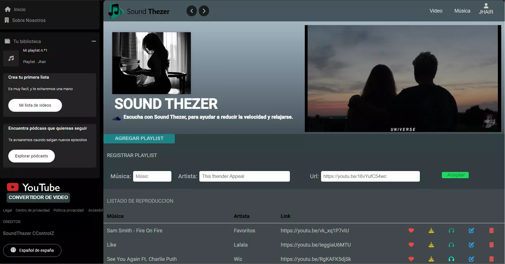

<div align="center">
    <a href="https://github.com/JheysonJhair/app_angular_client_soundthezer">
      
    </a>
    <h1>JhairDev - Soundthezer</h1>
    <p align="center">
        Full Stack Developer Jhair
    </p>
</div>



# Soundthezer

Bienvenido a **Soundthezer**, una aplicación diseñada para facilitar la descarga de videos y música, así como la selección de gustos musicales. Esta aplicación está enfocada en ofrecer una experiencia intuitiva y atractiva para los usuarios que desean acceder a su contenido favorito de manera sencilla.

## Tecnologías Utilizadas

- **Angular**: Framework principal utilizado para desarrollar la interfaz de usuario.
- **TypeScript**: Lenguaje utilizado para el desarrollo de la lógica de la aplicación.
- **CSS**: Para el diseño y estilización de la interfaz de usuario.

---

## Instalación

1. **Requisitos previos**:
   - Tener instalado **Node.js** y **npm** en tu sistema.

2. **Clonar el repositorio**:
   ```bash
   git clone https://github.com/JheysonJhair/app_angular_client_soundthezer
   cd app_angular_client_soundthezer
2. **Instala las dependencias con `npm install`.**

    ```bash
    npm install
    ```

3. **Ejecuta el comando `ng serve` para iniciar el servidor de desarrollo.**

    ```bash
    ng serve
    ```

4. **Abre tu navegador y visita `http://localhost:4200/`.**

¡Listo! Ahora puedes comenzar a trabajar la aplicación sin problemas.
